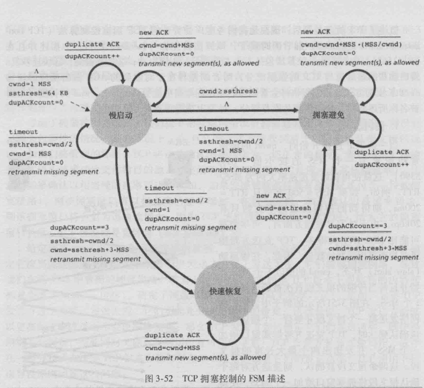

# 实验3-3 关于拥塞控制

姓名：曾泉胜

学号：1911396

---

## 原理与实现

本次实验在上一次的基础上，添加了拥塞控制和快速重传。拥塞控制遵循下面的FSM描述：



实现上比较简单，只需要修改发送方，在解析和重发的2个线程中分别添加对于new ACK, DUP ACK和timeout事件的响应即可。

值得一提的是，在我的实现中，协议包是定长的，没有设计MSS的概念，对于窗口、`rwnd`、`cwnd`都是以包为单位。因此，在拥塞避免阶段收到new ACK时，cwnd不是每次添加`1/cwnd`，而是在连续收到`cwnd`个new ACK之后递增1。

这些值尽管被多个线程读写，但是都是在获得了滑动窗口锁`winMutex`的前提下读写，因此不需要设计为原子量或者单独设计互斥锁。

在此基础上，我还实现了快速重传机制，当连续收到`DUP_ACK`（默认为3）个DUP ACK时，提前结束定时器，使得重发线程能够立即重传。


## 实验验证

### 正确性

启用日志模式编译并运行程序，截取发送方部分日志内容如下：

state=0为慢启动状态，state=1为拥塞避免状态，state=2为快速重传状态

```
new ACK, state: 0, cwnd: 1, ssthresh: 1, dupACKCount: 0
ACK [0, 1)
rdt_send blocked! sendWin(8): 3, recvRwnd: 8, cwnd: 2
recvRwnd: 8
new ACK, state: 1, cwnd: 2, ssthresh: 1, dupACKCount: 0
ACK [1, 2)
rdt_send blocked! sendWin(8): 3, recvRwnd: 8, cwnd: 2
recvRwnd: 8
new ACK, state: 1, cwnd: 2, ssthresh: 1, dupACKCount: 0
ACK [2, 3)
rdt_send blocked! sendWin(8): 4, recvRwnd: 8, cwnd: 3
recvRwnd: 8
new ACK, state: 1, cwnd: 3, ssthresh: 1, dupACKCount: 0
ACK [3, 4)
rdt_send blocked! sendWin(8): 4, recvRwnd: 8, cwnd: 3
recvRwnd: 8
new ACK, state: 1, cwnd: 3, ssthresh: 1, dupACKCount: 0
ACK [4, 5)
rdt_send blocked! sendWin(8): 4, recvRwnd: 8, cwnd: 3
recvRwnd: 8
new ACK, state: 1, cwnd: 3, ssthresh: 1, dupACKCount: 0
ACK [5, 6)
rdt_send blocked! sendWin(8): 5, recvRwnd: 8, cwnd: 4
recvRwnd: 8
new ACK, state: 1, cwnd: 4, ssthresh: 1, dupACKCount: 0
...
new ACK, state: 1, cwnd: 4, ssthresh: 1, dupACKCount: 0
ACK [189, 190)
rdt_send blocked! sendWin(8): 5, recvRwnd: 8, cwnd: 4
recvRwnd: 7
dup ACK, state: 1, cwnd: 4, ssthresh: 1, dupACKCount: 1
DUP ACK 190
rdt_send blocked! sendWin(8): 5, recvRwnd: 7, cwnd: 4
recvRwnd: 6
dup ACK, state: 1, cwnd: 4, ssthresh: 1, dupACKCount: 2
DUP ACK 190
rdt_send blocked! sendWin(8): 5, recvRwnd: 6, cwnd: 4
recvRwnd: 5
FAST RETRANSMIT
dup ACK, state: 1, cwnd: 4, ssthresh: 1, dupACKCount: 3
DUP ACK 190
rdt_send blocked! sendWin(8): 6, recvRwnd: 5, cwnd: 5
recvRwnd: 4
FAST RETRANSMIT
dup ACK, state: 2, cwnd: 5, ssthresh: 2, dupACKCount: 3
DUP ACK 190
rdt_send blocked! sendWin(8): 6, recvRwnd: 4, cwnd: 6
timeout, state: 2, cwnd: 6, ssthresh: 2, dupACKCount: 0
timeout: resend seq 190
recvRwnd: 3
dup ACK, state: 0, cwnd: 1, ssthresh: 3, dupACKCount: 1
DUP ACK 190
rdt_send blocked! sendWin(8): 6, recvRwnd: 3, cwnd: 1
recvRwnd: 8
new ACK, state: 0, cwnd: 1, ssthresh: 3, dupACKCount: 0
ACK [190, 196)
...

```

> 从上面的日志可以看出拥塞控制的状态转移，但是同时也存在着和理论上的一些差距，例如FAST RETRANSMIT出现多次，重发线程才重发，考虑是`INTEVAL`较大，发送线程占用锁时间长导致重发线程未及时调度造成的。

### 性能

| 符号                 | 含义                    | 备注                        |
| -------------------- | ----------------------- | --------------------------- |
| `N`                  | 窗口大小                | 单位：包                    |
| `NUM_SEQNUM`         | 序号空间大小            | 单位：包，至少为2N          |
| `TIMEOUT`            | 发送方超时时间          | 单位：ms                    |
| `INTERVAL`           | 检查定时器间隔          | 单位：ms，不超过TIMEOUT     |
| `FLOW_CONTROL`       | 发送方是否启用流量控制  | True或False                 |
| `DELAY`              | 接收方是否启用延迟ACK   | True或False                 |
| `ACK_DELAY`          | 接收方延迟ACK时间       | 单位：ms                    |
| `SENDER_RECV_BUF`    | 发送方接收缓冲区大小    | 单位：包                    |
| `RECVER_RECV_BUF`    | 接收方接收缓冲区大小    | 单位：包                    |
| `CONGESTION_CONTROL` | 发送方是否启用拥塞控制  | True或False                 |
| `INIT_SSTHRESH`      | 慢启动初始阈值          | 单位：包                    |
| `DUP_ACK`            | 激活快速重传的DUP ACK数 | 单位：个                    |
| `FAST_RETRANSMIT`    | 发送方是否启用快速重传  | True或False                 |
| `LOG`                | 是否输出日志            | True或False，开启后影响性能 |

> 一个数据包大小为10240字节

#### 测试1

测试在2%丢包率，延迟5ms时，是否使用拥塞控制的影响，条件如下：

```json
{
    "N": 8, 
    "NUM_SEQNUM": 65536, 
    "TIMEOUT": 200, 
    "INTERVAL": 50, 
    "FLOW_CONTROL": false, 
    "DELAY": true, 
    "ACK_DELAY": 500, 
    "SENDER_RECV_BUF": 16, 
    "RECVER_RECV_BUF": 16, 
    "CONGESTION_CONTROL": [true, false], 
    "INIT_SSTHRESH": 4, 
    "DUP_ACK": 3, 
    "FAST_RETRANSMIT": false, 
    "LOG": false
}
```

| 拥塞控制 | 文件大小（Bytes） | 传输时间（ms） | 吞吐率（Mb/s） |
| -------- | ----------------- | -------------- | -------------- |
| 使用     | 11968994          | 24442.49       | 3.92           |
| 不使用   | 11968994          | 28290.84       | 3.38           |

## 测试2

测试在2%丢包率时，是否使用快速重传的影响，条件如下：

```json
{
    "N": 8, 
    "NUM_SEQNUM": 65536, 
    "TIMEOUT": 200, 
    "INTERVAL": 50, 
    "FLOW_CONTROL": false, 
    "DELAY": true, 
    "ACK_DELAY": 500, 
    "SENDER_RECV_BUF": 16, 
    "RECVER_RECV_BUF": 16, 
    "CONGESTION_CONTROL": true, 
    "INIT_SSTHRESH": 4, 
    "DUP_ACK": 3, 
    "FAST_RETRANSMIT": [true, false], 
    "LOG": false
}
```

| 快速重传 | 文件大小（Bytes） | 传输时间（ms） | 吞吐率（Mb/s） |
| -------- | ----------------- | -------------- | -------------- |
| 使用     | 11968994          | 22160.92       | 4.32           |
| 不使用   | 11968994          | 31338.47       | 3.06           |

### 如何快速实验

> 实验环境： OS: Win10，Compiler: gcc version 9.2.0 (tdm64-1)，python interpreter (>=3.7)，此外还需要Windows SDK，默认配置下，保证本机8888,9997,9999端口不被占用

为了实验3-4做准备，我稍稍改动了项目结构，添加了编译和统计的`python`脚本，这里简要说明默认配置下，快速实验的方法（控制变量法）：

1. 在项目根目录下运行`python config.py`，根据提示输入需要变化的变量和其他不变量的值。
2. 开启`test`目录下的`Router.exe`设置从127.0.0.1:8888端口转发到127.0.0.1:9999端口，并设置一定的丢包率和延迟
3. 在`bin`目录下新生成了一个后缀为日期和时间的文件夹，其中有一系列子文件夹，在每个子文件夹下，依次运行`recv.bat`和`send.bat`，可以看到重定向的输出`send.out`和`recv.out`，接收到的文件`3.jpg`以及用于统计的`result.txt`
4. 运行`python statistic.py`，输入`bin`下的某个目录，将生成相关的统计信息。

