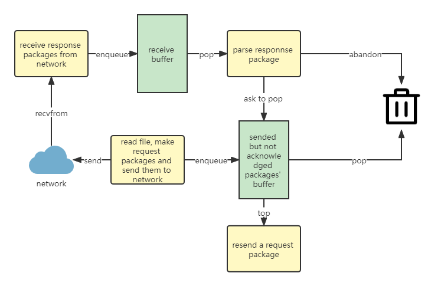
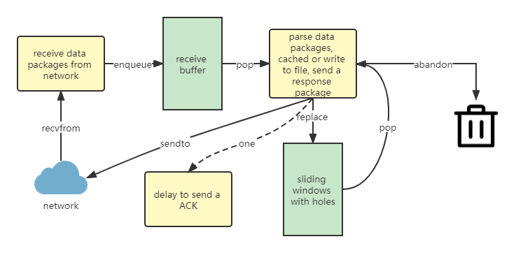

# 实验3-2 关于累积确认和流量控制

学号：1911396

姓名：曾泉胜

---

## 概述

我在实验3-1做出的GBN的基础上，参考TCP协议的实现，在功能上进行了如下的修改：

- 将发送方的单个确认改为了累积确认，超时重传也从重传所有未确认的包改为重传第一个未确认的包；
- 对于发送方和接收方，添加接收缓冲，将接收事件与包解析事件分离，是希望接收线程在收到一个包后，能够尽快的重新回到`recvfrom`，在端口上监听，而不要被更多耗时的解析任务影响，造成了仅仅因为自己没听到（而不是网络原因造成的丢包）。
- 接收方使用与发送方相同大小的滑动窗口，当接收到能够放在滑动窗口中的失序数据包时，缓存而非丢弃。
- 在接收方，尝试了教材表3-2中产生TCP-ACK的建议[RFC 5681]，即延迟ACK。
- 在发送方实现了流量控制。
- 上次实验报告中，对于连接建立和断开的讨论存在问题，将计时工作改到发送方。

## 细节与讨论

### 关于序号单位

如果严格遵循TCP协议的内容，数据包的序号不再以包为单位递增，而是以字节为单位增加。序号空间则为$2^{32}$大小。对于我来说，一方面，我希望让打印的日志更易于DEBUG，另一方面，我认为在我每次发送固定大小的包的前提下，这种修改不会改进传输时间和吞吐率。因此我仍然让序号以包为单位递增，并且支持在序号空间中循环。当然，仍然要保证序号空间的大小至少为滑动窗口大小的2倍。

### 协议的变化

相比于上次实验，为了支持流量控制，在协议中新增了一个rwnd的字段，表示对方缓冲区的剩余空间。

### 连接与断开连接

我在发送方计时，只要发送方能在接收方正常退出时也退出，那计时就是可靠的：

1. 开始时，发送方向接收方不断地发送SYN报文，直到收到接收方回复的SYN ACK。此时发送方可以发送文件，计时开始。
2. 当发送方将从文件中读取并打包的最后一个包放进滑动窗口，关闭文件句柄，并把FIN包接着放进滑动窗口。接收方在收到该FIN包时，可能是失序的，因此不能立即结束，而是跟处理其他数据包一样，等到接收的滑动窗口被填满或部分填满时，针对FIN包，特地回复一个FIN ACK。此时我就允许接收方退出了，如果发送方接到了这个FIN ACK包，确凿证明传输结束，停止计时，退出；如果发送方没有收到，但是接收方进程已经退出，那就重新该次实验吧。

### 流程图

> 符号沿用上次实验报告中的设定

黄色的圆角矩形代表线程，绿色的矩形代表可随机访问的循环队列（`circlequeue.hpp`），数据包在**发送方**的流动如下图所示：

1. 接收线程：监听-将收到的所有数据包依次加入**接收缓冲队列**（后称recvBuf）-监听。当缓冲区满时阻塞。
2. 解析线程：recvBuf非空条件下，从中取出数据包，校验，检查序列号。对于校验通过，并且序列号`seqnum`在`(base, (base+N)%NUM_SEQNUM]`范围内的ACK包，弹出**发送但未确认缓冲区**（后称sendWin）中前`(seqnum-base+NUM_SEQNUM)%NUM_SEQNUM`个包，并且将`base`更新为`seqnum`；否则，这些数据包就视为DUP ACK，直接抛弃。如果sendWin弹空了，则暂停定时器。
3. 发送线程：读文件，在sendWin非满以及接收方rwnd不为0的条件下，向队列的`(nextseqnum-base+NUM_SEQNUM)%NUM_SEQNUM`处放置数据包，放置后sendWin满，则启动定时器。
4. 重发线程：在定时器已启动并且到时时，重发sendWin中队首的一个包。

数据包在**接收方**的流动如下图所示：

1. 接收线程：监听-将收到的所有数据包依次加入**接收缓冲队列**（后称recvBuf）-监听。当缓冲区满时阻塞。
2. 解析和发送线程：recvBuf非空条件下，从中取出数据包，校验，检查序列号。对于校验通过，并且序列号`seqnum`在`[base, (base+N)%NUM_SEQNUM)`范围内的数据包，放入接收端滑动窗口（后称recvWin）的`(seqnum-base+NUM_SEQNUM)%NUM_SEQNUM`位置，之后将recvWin中前k个非空的包的数据部分写入文件，更新`expectedseqnum+=k`，再向发送序号为`expectedseqnum`的ACK包。
3. 使用延迟ACK线程，在一定的条件（见[关于延迟ACK](### 关于延迟ACK)一节）下，发送延迟的ACK。

计时器的实现

### 关于延迟ACK

我尝试了教材上的这个建议：

有一些问题需要注意：

- 延时的ACK已经被后续的ACK确认，那么该ACK再发送不仅没有意义，还可能因为序号回卷，被发送方默认为一个新的累积ACK，因此后续的ACK如果覆盖了延迟ACK的功能，我会取消延迟ACK的发送。
- 需要在不同环境下验证，启动一个线程（我使用了线程池避免了线程启动和销毁的开销）与少发一个ACK之间的trade-off

### 关于流量控制

由于是单向传输，我只在发送方实现了流量控制。流量控制的目的是什么？但接收方的缓存区满时，收到发送方的数据包都会被抛弃，在这种情况下，希望告诉A也不要发送了，把网络资源让出来。

这里有两个问题：

1. 接收方的缓冲区具体指什么？在我的实现中，接收方有两个缓冲区（见先前的图片）。目前只有接收缓存满了才会导致数据流的阻塞，不过我还是将我将rwnd设置为这两个缓冲区剩余空间的最小值。
2. 发送方收到接收方rwnd=0的消息，理论上：应当停止发送和超时重发，且考虑到接收方此时可能恰好也没有发来的数据包，传输过程就会停滞，因此还要再启动一个定时器，去“试探”得到接收方更新的缓冲区剩余空间。在我的实现中，超时重发的线程也能够满足这个需求，因此发送方在收到接收方rwnd=0的消息时，仅停止发送线程。

## 测试

### 正确性

实验课上给助教演示。

### 性能

下面对我比较感兴趣的几个方面做一些简单的测试。

#### 测试1

共同条件：

| 发送方接收缓冲区（包） | 接收方接收缓冲区（包） | 发送方超时时间（ms) | 流量控制 | 延迟ACK（ms） | 丢包率      | 延迟        | 文件大小（Bytes） |
| ---------------------- | ---------------------- | ------------------- | -------- | ------------- | ----------- | ----------- | ----------------- |
| 16                     | 16                     | 100                 | 启用     | 30            | 0(LoopBack) | 0(Loopback) | 11968994          |

| 窗口大小 | 时间（ms） | 吞吐率（Mb/s） |
| -------- | ---------- | -------------- |
| 1        | 35992.10   | 2.66           |
| 2        | 66.88      | 1431.63        |
| 4        | 56.54      | 1693.59        |
| 8        | 52.08      | 1838.56        |
| 16       | 54.07      | 1770.99        |
| 32       | 48.61      | 1969.88        |

在窗口大小为1时，推测是由于条件变量控制下，线程之间反复停止、唤醒的频率太高，开销太大。

#### 测试2

| 发送方接收缓冲区（包） | 接收方接收缓冲区（包） | 发送方超时时间（ms) | 流量控制 | 延迟ACK（ms） | 丢包率（%） | 延迟（ms） | 文件大小（Bytes） |
| ---------------------- | ---------------------- | ------------------- | -------- | ------------- | ----------- | ---------- | ----------------- |
| 16                     | 16                     | 100                 | 启用     | 30            | 1           | 1          | 11968994          |

| 窗口大小 | 时间（ms） | 吞吐率（Mb/s） |
| -------- | ---------- | -------------- |
| 1        | 59344.69   | 1.61           |
| 2        | 22714.66   | 4.22           |
| 4        | 22294.04   | 4.29           |
| 8        | 42158.23   | 2.27           |
| 16       | 38940.30   | 2.46           |
| 32       | 87066.25   | 1.10           |

#### 测试3

| 窗口大小（N） | 发送方接收缓冲区（包） | 接收方接收缓冲区（包） | 发送方超时时间（ms) | 流量控制 | 丢包率（%） | 延迟（ms） | 文件大小（Bytes） |
| ------------- | ---------------------- | ---------------------- | ------------------- | -------- | ----------- | ---------- | ----------------- |
| 8             | 16                     | 16                     | 100                 | 启用     | 1           | 1          | 11968994          |

| 延迟ACK（ms） | 时间（ms） | 吞吐率（Mb/s） |
| ------------- | ---------- | -------------- |
| 不使用        | 41576.15   | 2.30           |
| 30            | 42158.23   | 2.27           |
| 100           | 46993.14   | 2.04           |
| 300           | 43602.12   | 2.20           |
| 500           | 40389.66   | 2.37           |

猜测过小的延迟时间可能还不抵线程切换的开销，稍大的延迟时间在一定的丢包率下能够体现效果。此外，改进的程度可能还取决与滑动窗口大小和发送方超时时间。